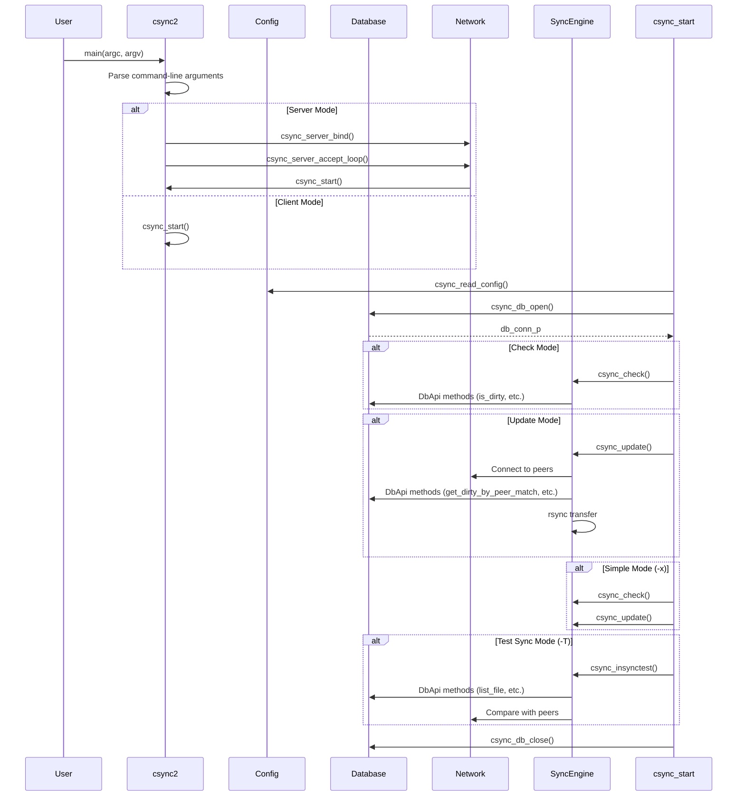

```mermaid
sequenceDiagram
    participant User
    participant csync2
    participant Config
    participant Database
    participant Network
    participant SyncEngine

    User->>csync2: main(argc, argv)
    csync2->>csync2: Parse command-line arguments
    alt Server Mode
        csync2->>Network: csync_server_bind()
        csync2->>Network: csync_server_accept_loop()
        Network->>csync2: csync_start()
    else Client Mode
        csync2->>csync2: csync_start()
    end

    csync_start->>Config: csync_read_config()
    csync_start->>Database: csync_db_open()
    Database-->>csync_start: db_conn_p

    alt Check Mode
        csync_start->>SyncEngine: csync_check()
        SyncEngine->>Database: DbApi methods (is_dirty, etc.)
    end

    alt Update Mode
        csync_start->>SyncEngine: csync_update()
        SyncEngine->>Network: Connect to peers
        SyncEngine->>Database: DbApi methods (get_dirty_by_peer_match, etc.)
        SyncEngine->>SyncEngine: rsync transfer
    end

    alt Simple Mode (-x)
        csync_start->>SyncEngine: csync_check()
        csync_start->>SyncEngine: csync_update()
    end

    alt Test Sync Mode (-T)
        csync_start->>SyncEngine: csync_insynctest()
        SyncEngine->>Database: DbApi methods (list_file, etc.)
        SyncEngine->>Network: Compare with peers
    end

    csync_start->>Database: csync_db_close()
```
