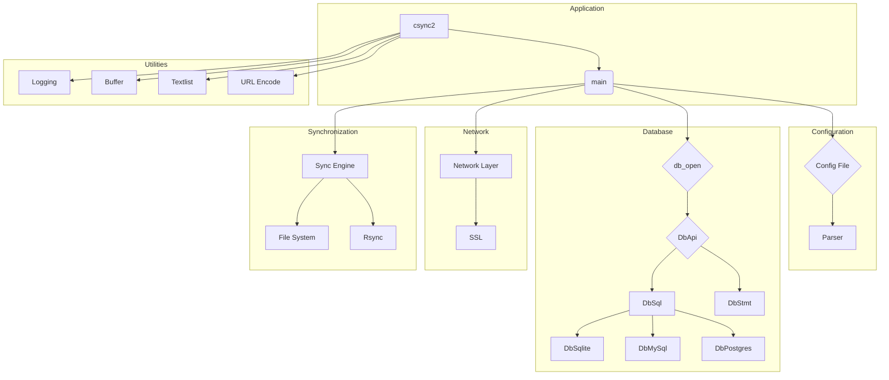

```mermaid
graph TD
    subgraph Application
        A[csync2] --> B(main)
    end

    subgraph Configuration
        B --> C{Config File}
        C --> D[Parser]
    end

    subgraph Database
        B --> E{db_open}
        E --> F{DbApi}
        F --> G[DbSql]
        G --> H[DbSqlite]
        G --> I[DbMySql]
        G --> J[DbPostgres]
        F --> K[DbStmt]
    end

    subgraph Network
        B --> L[Network Layer]
        L --> M[SSL]
    end

    subgraph Synchronization
        B --> N[Sync Engine]
        N --> O[File System]
        N --> P[Rsync]
    end

    subgraph Utilities
        Q[Logging]
        R[Buffer]
        S[Textlist]
        T[URL Encode]
    end

    A --> Q
    A --> R
    A --> S
    A --> T
```
